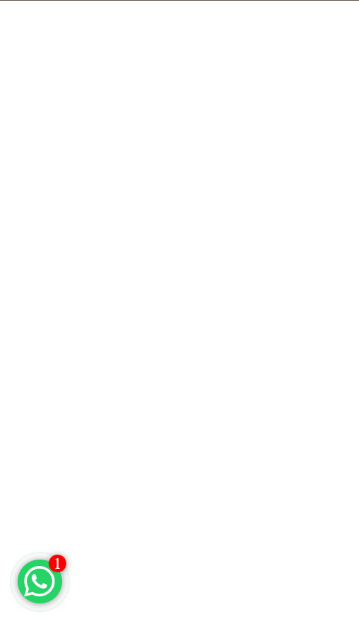
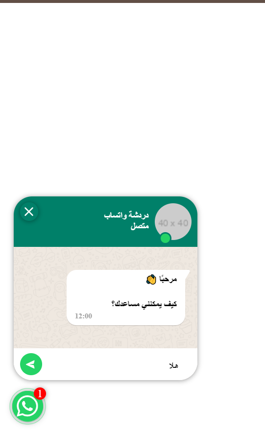
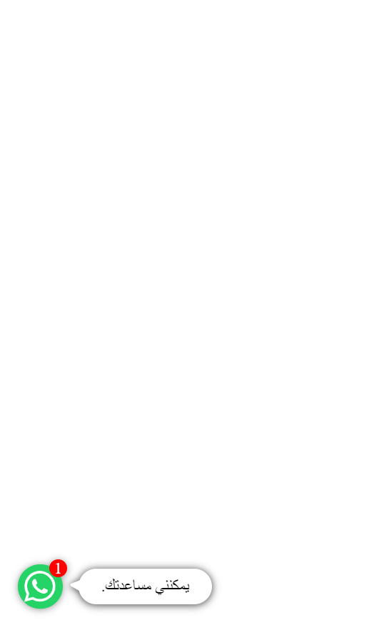

خطوات تشغيل مشروع زر WhatsApp العائم بطريقة مرتبة ومنظمة:

### الخطوة 1: **تضمين ملف CSS**
   - أولاً، تحتاج إلى تضمين ملف التنسيق (CSS) في رأس الصفحة (داخل وسم `<head>`).
   - هذا الملف يحتوي على جميع التنسيقات اللازمة لجعل زر WhatsApp العائم يظهر ويبدو بشكل جيد.
   - يمكن تضمين الملف كما يلي:

   ```html
   <link rel="stylesheet" href="whatsappFloatingButton.css">
   ```

### الخطوة 2: **تضمين ملف JavaScript**
   - بعد تضمين ملف CSS، تحتاج إلى تضمين ملف JavaScript الذي يحتوي على الكود اللازم لتشغيل منطق الزر العائم.
   - هذا الملف يحتوي على الكلاس `WhatsAppFloatingButton` ووظيفته إنشاء وتشغيل الزر العائم.
   - يجب تضمين ملف JavaScript في نهاية وثيقة HTML، قبل وسم `</body>`, لضمان تحميل الـ HTML و الـ CSS أولاً.
   
   ```html
   <script src="whatsappFloatingButton.js"></script>
   ```

### الخطوة 3: **إنشاء عنصر div لاستضافة واجهة الدردشة**
   - بعد تضمين الملفات، تحتاج إلى إضافة عنصر `div` في جسم الصفحة (`<body>`) لاستضافة الزر العائم وواجهة الدردشة.
   - هذا `div` سيستخدمه الكود لاحقاً لعرض الزر العائم في المكان المحدد.

   ```html
   <div id="whatsapp-chat"></div>
   ```

### الخطوة 4: **استدعاء دالة init من الكلاس**
   - بعد إنشاء العنصر `div`، نحتاج إلى تفعيل الزر العائم عن طريق استدعاء دالة `init` من الكلاس `WhatsAppFloatingButton`.
   - هذه الدالة تأخذ المعلمات التالية:
     - **المعرف (`#whatsapp-chat`)**: معرف العنصر `div` الذي أنشأته.
     - **رقم الهاتف**: الرقم الذي سيتم إرسال الرسائل إليه.
     - **اسم التطبيق**: النص الذي سيظهر كعنوان للدردشة.
     - **رابط الصورة**: صورة مصغرة تظهر بجانب اسم التطبيق.
     - **اللغة**: اللغة التي ستعرض بها الرسائل (مثل 'ar' للعربية أو 'en' للإنجليزية).

   - الكود التالي يستدعي الدالة:

   ```html
   <script>
       WhatsAppFloatingButton.init('#whatsapp-chat', '123456789', 'دردشة واتساب', 'https://via.placeholder.com/40', 'ar');
   </script>
   ```

### ملخص الخطوات:

1. **تضمين ملف CSS**: في وسم `<head>` لإضافة التنسيقات.
2. **تضمين ملف JavaScript**: في نهاية وثيقة HTML لتشغيل الكود البرمجي.
3. **إنشاء عنصر `div`**: لإضافة مكان في الصفحة يعرض فيه الزر العائم.
4. **استدعاء دالة `init`**: لتهيئة الزر باستخدام رقم الهاتف، اللغة، الاسم، والصورة.

### بعد هذه الخطوات، سيظهر الزر العائم لواتساب في صفحتك، وسيمكن للزوار الضغط عليه لبدء محادثة معك.
<h1>شكل في المتصفح</h1>
1.**صوره 1**
<br>
 <center></center>
 2.**صوره 2**
<br>
 <center></center>

  3.**صوره 3**
<br>
 <center></center>
   4.**صوره 4**
<br>
 <center></center>